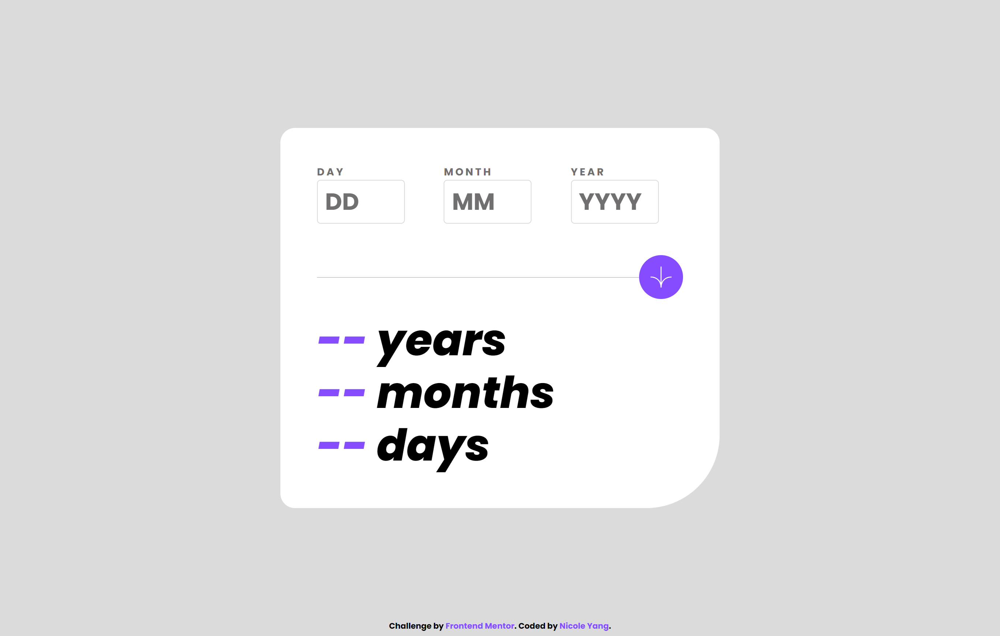
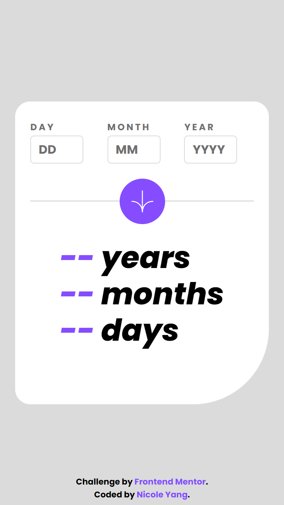

# Frontend Mentor - Age calculator app solution

This is a solution to the [Age calculator app challenge on Frontend Mentor](https://www.frontendmentor.io/challenges/age-calculator-app-dF9DFFpj-Q). Frontend Mentor challenges help you improve your coding skills by building realistic projects. 

## Table of contents

- [Overview](#overview)
  - [The challenge](#the-challenge)
  - [Screenshot](#screenshot)
  - [Links](#links)
- [My process](#my-process)
  - [Built with](#built-with)
- [Author](#author)

## Overview

### The challenge

Users should be able to:

- View an age in years, months, and days after submitting a valid date through the form
- Receive validation errors if:
  - Any field is empty when the form is submitted
  - The day number is not between 1-31
  - The month number is not between 1-12
  - The year is in the future
  - The date is invalid e.g. 31/04/1991 (there are 30 days in April)
- View the optimal layout for the interface depending on their device's screen size
- See hover and focus states for all interactive elements on the page

### Screenshot

    <h5>Desktop: </h5>
    

    <h5>Mobile: </h5>
    

### Links

- Solution URL: [https://www.frontendmentor.io/solutions/responsive-page-with-react-sass-css-flexbox-and-grid-momentjs-xE6WgyFsFO](https://www.frontendmentor.io/solutions/responsive-page-with-react-sass-css-flexbox-and-grid-momentjs-xE6WgyFsFO)
- Live Site URL: [https://nicoleyry-age-calculator-app.netlify.app/](https://nicoleyry-age-calculator-app.netlify.app/)

## My process

### Built with

- Semantic HTML5 markup
- CSS custom properties
- Flexbox
- CSS Grid
- Mobile-first workflow
- [React](https://reactjs.org/) - JS library
- [SASS](https://sass-lang.com/) - For styles
- [Moment.js](https://momentjs.com/) - For dates calculation and validation

## Author

- Website - [Nicole Yang](https://www.nicoleyry.com/)
- Frontend Mentor - [@nicoleyry](https://www.frontendmentor.io/profile/nicoleyry)
- Twitter - [@nicoleyry](https://twitter.com/nicoleyry)